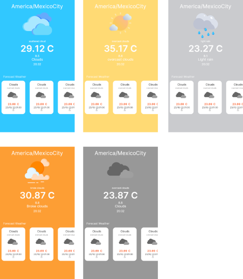

# Simple weather app :partly_sunny: 

The function of this application is to display the weather of the region by consuming data from an API using the Retrofit library in the same way that we use the MVVM pattern with the application architecture. 

*This practice aims to understand how to user or implement some libraries such as retrofit ,coroutines,livedata, android-gif-drawable and data binding that allows us to bind our UI.*

## Used Librarys :card_file_box:

## Preview about the application :iphone:

 Preview of the application
 
 
